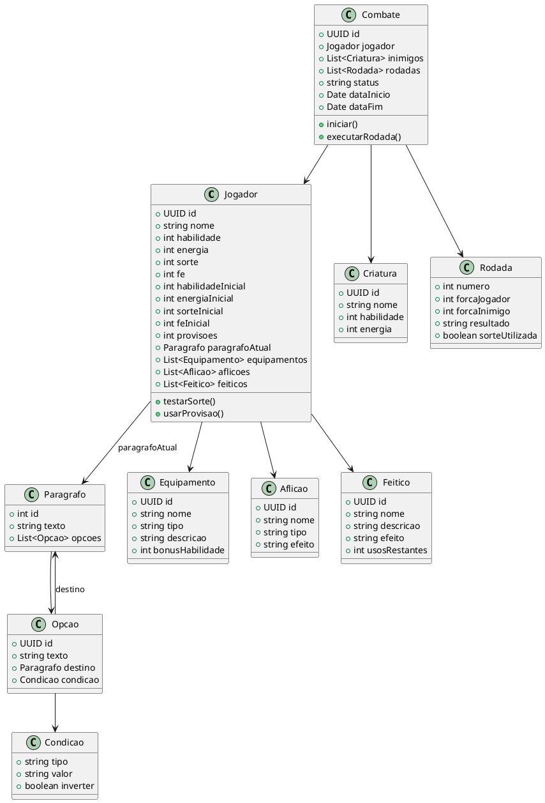

# Diagrama de Classes - Projeto RPG de Texto

Este documento apresenta o diagrama de classes em formato textual UML, representando os principais elementos do domínio do projeto baseado no livro-jogo *A Cripta do Vampiro*.

---

## 🎓 Modelo UML (PlantUML)

> Este diagrama pode ser visualizado em ferramentas como [PlantUML Live](https://www.planttext.com/) ou plugins do VSCode.